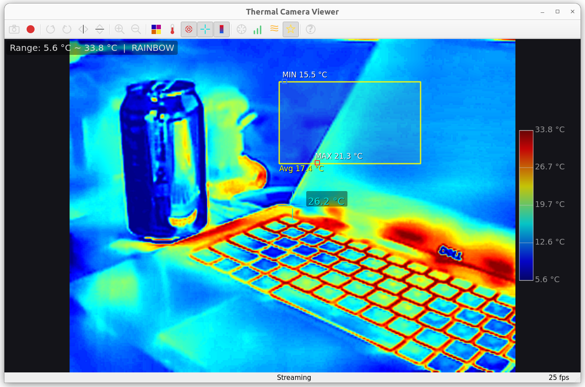

# P3 IR Camera

Python driver, Qt desktop application, and virtual webcam driver for P3-series USB thermal cameras (Thermal Master P3/P1).



> **Disclaimer**: This is an independent open-source project. It is not affiliated with, endorsed by, or connected to any camera manufacturer. Protocol details were determined through USB traffic analysis and experimentation.

## Supported Hardware

| Model | PID | Resolution | Frame Rate |
|-------|-----|-----------|------------|
| P3 | `0x45A2` | 256 × 192 | 25 fps |
| P1 | `0x45C2` | 160 × 120 | 25 fps |

These are commonly sold as "Thermal Master P3", "InfiRay P2 Pro", and similar USB-C thermal cameras designed for smartphones. Any camera with VID `0x3474` and one of the above PIDs should work.

## Features

### Qt Viewer Application (Linux, macOS & Windows)
- **Real-time thermal display** at 25 fps with mouse-over temperature readout
- **Region of Interest (ROI)** — drag a box to see max/min/average temperature within the region, with small markers tracking the hottest and coldest points
- **6 color palettes** — White Hot, Black Hot, Rainbow, Ironbow, Military, Sepia
- **Image enhancement** — CLAHE + DDE (Detail Density Enhancement) + temporal noise reduction
- **Screenshot** (PNG) and **video recording** (MP4 via FFmpeg)
- **Rotate** (90° CW/CCW) and **flip** (horizontal/vertical)
- **Zoom** — image-level zoom without window resizing
- **Celsius / Fahrenheit** toggle
- **Center reticle** and **color bar** overlays
- **Hotspot markers** — global max/min temperature points
- **Shutter / NUC** trigger, gain mode toggle, emissivity cycling
- **Adaptive UI** — font sizes scale with window size; crosshair cursor on hover

### UVC Virtual Webcam (Linux only)
- **Plug-and-play** — camera automatically appears as `/dev/video10` when plugged in, disappears when unplugged
- **Works with any V4L2 app** — Zoom, VLC, OBS, Google Meet, Cheese, etc.
- **Power-saving standby** — physical camera stays idle when no app is reading the virtual webcam; wakes automatically when an app opens the device

### Original OpenCV Viewer & Lock-in Thermography
- Basic OpenCV viewer (`p3_viewer.py`) for simple frame capture
- Rudimentary lock-in thermography for finding very small temperature changes (`lockin.py`). See [LOCK-IN.md](LOCK-IN.md)

## Installation

### Linux (Ubuntu / Debian)

#### Build & Install
```bash
git clone https://github.com/jvdillon/p3-ir-camera.git
cd p3-ir-camera
./install.sh
```

The install script automatically builds the `.deb` package if needed, handles upgrades and broken states, and installs all dependencies. It also sets up `udev` rules.

### macOS

#### Build & Install
```bash
git clone https://github.com/jvdillon/p3-ir-camera.git
cd p3-ir-camera
./install.sh
```

The install script detects macOS, installs dependencies via Homebrew, creates an embedded Python venv inside the app bundle (PEP 668–safe), and copies `Thermal Camera Viewer.app` to `/Applications`.

> **Note**: The UVC virtual webcam feature is Linux-only (requires the `v4l2loopback` kernel module). On macOS and Windows, only the viewer application is available.

### Windows

#### Prerequisites
- Windows 10 or 11 (64-bit)
- Python 3.10+
- **USB driver for PyUSB**: pyusb requires a libusb-compatible driver. Use [Zadig](https://zadig.akeo.ie/):
  1. Download and run Zadig
  2. Options → List All Devices
  3. Select the camera (VID 3474, PID 45C2 for P1 or 45A2 for P3)
  4. Select **WinUSB** driver
  5. Click "Replace Driver"

#### Install (PowerShell)
```powershell
git clone https://github.com/jvdillon/p3-ir-camera.git
cd p3-ir-camera
Set-ExecutionPolicy -Scope CurrentUser RemoteSigned -Force   # if scripts are blocked
.\install-windows.ps1
.\.venv\Scripts\python.exe -m thermal_camera_viewer
```

## Usage

### Qt Viewer

Launch from terminal:
```bash
thermal-camera-viewer
```

On macOS, open "Thermal Camera Viewer" from the Applications folder or Launchpad.
On Windows, run `python -m thermal_camera_viewer` from the activated `.venv` (see above).

Screenshots and recordings go to **Pictures** and **Videos** under your user profile (`%USERPROFILE%`).

#### Keyboard Shortcuts

| Key | Action |
|-----|--------|
| `Space` | Screenshot |
| `F5` | Start / stop recording (requires `ffmpeg` on `PATH`) |
| `R` / `Shift+R` | Rotate 90° clockwise / counter-clockwise |
| `M` / `V` | Flip horizontal / vertical |
| `+` / `-` | Zoom in / out |
| `C` | Cycle color palette |
| `F` | Toggle °C / °F |
| `N` | Toggle hotspot markers |
| `T` | Toggle center reticle |
| `B` | Toggle color bar |
| `S` | Trigger shutter / NUC |
| `G` | Toggle gain high / low |
| `E` | Cycle emissivity |
| `P` | Toggle enhanced mode (CLAHE + DDE) |
| `H` | Help |
| `Q` | Quit |

### Virtual Webcam (Linux only)

After installation, just plug in the camera. `/dev/video10` appears automatically. Open it in any webcam app:
```bash
# VLC
vlc v4l2:///dev/video10
```

### Original Viewer

```bash
# Use P3 camera (default, 256×192)
p3-viewer

# Use P1 camera (160×120)
p3-viewer --model=p1

# Lock-in thermography - press 'l' once viewer is open
p3-viewer --frequency 0.1 --integration 120
```

## Protocol Documentation

See [P3_PROTOCOL.md](P3_PROTOCOL.md) for USB protocol details.

## Recent Updates (Merged Features)

- **Full Qt GUI:** Rich graphical interface supporting ROI, enhancements, video recording, etc.
- **Multi-OS Installers:** Added `.deb` packaging for Linux, `.app` bundle for macOS, and `.ps1` installer for Windows.
- **UVC Virtual Webcam (Linux):** Added a background daemon utilizing `v4l2loopback` to expose the camera as a standard V4L2 webcam.

## Contributing

This project provides scaffolding for a P3 thermal camera application. There's significant potential to build something great here, and contributions are welcome!

## License

Apache 2.0
